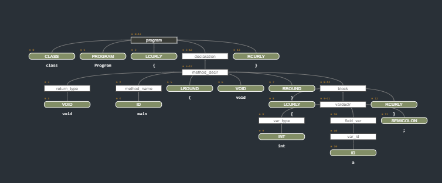

<h1 align="center">
<br>
   
<br>
<br>
Proyecto 1: Analizador semántico
</h1>
    
<p align="center">
  
  <a href="https://opensource.org/licenses/MIT">
    " alt="No license">
  </a>
</p>

<p align="center">University Project :mortar_board:</p>
<p align="center">Alejandro Tejada 17584</p>
<p align="center">Construccion de compiladores</p>
<p align="center">Universidad del Valle de Guatemala</p>
<p align="center">1/09/2021</p>
<hr />

# Acerca de...

Este proyecto es el primero de tres de construccion de un compilador. Esa fase es la análisis semántico. Significa, que se construye un arbol con ANTLR 4 y luego vamos analizando recorriendo el arbol y viendo que cumpla con las reglas gramaticales.
Algunos puntos vistos en este proyecto
- Lectura de archivos txt o .decaf
- Graficado de arboles sintácticos de ANTLR para mejor visualización
- Revisión semántica del código

# Descripción de herramientas  y archivos archivos

## Listado de herramientas usadas para el proyecto

- Python 3.8.0 64bits
- Compiladores principios, técnicas y herramientas, 2da Edición - Alfred V. Aho
- VS Code
- Windows Terminal
- A lot of Coffe (more Coffe than last time) (**enought coffe for a life V3**)


## Liberías NECESARIAS para correr el programa

- Python 3.8.0
  - Una versión de Python de la versión Python 3.6.0 64bits o mayor
- Pprint
  - Una librería de python para imprimir bonito. Si no se tiene instalar en https://pypi.org/project/pprintpp/
- Terminal
  - Una terminal o programa para correr los programas de python. Puede ser VS Code también.
- Emoji
  - Una librería para poner emojis. Instalar en : https://pypi.org/project/emoji/


## Archivos y carpetas
| No. | Archivo | Propósito/Descripción |
| --- | --- | --- |
| 1 | `Python3` |Folder donde esta la gramática, los lexer, parser, etc. Acá dentro también se encuentran los archivos de prueba y lo que se prueba |
| 2 | `decafAlejandro.tokens` |Tokens generados por ANTLR|
| 3 |`decafAlejandroLexer.py`  |Es un python generado por ANTLR que contiene el lexer del proyecto|
| 4 | `decafAlejandroListener.py` |Contiene un listener, es decir, una forma de recorrer el arbol sintáctico generado|
| 5 | `decafAlejandroParser.py` |el parser generador por ANTLR para el proyecto|
| 6 | `ErrorClass.py` |Una clase de errores para arrays o errores generales|
| 7 | `funciones.py` |Un python con funciones generales y útiles|
| 8 | `main.py |programa más importante. Acá se genera la logica, los valores, y se revisan TODAS las reglas semánticas|
| 9 | `rúbrica_proyecto_1.pdf` |La rubrica del proyecto|
| 10 | `symbolTable.py` |Clase que contiene TODAS las declaraciones para las tres tablas de simbolos principales: metodos, variables y estructuras|
| 11 | `Readme.md` |El readme|
| 12 | `Python3/Programas/simple.decaf` |El programa donde probamos por defecto|


<br>
<br>


## Ejemplo de un arbol sintáctico simple


## Cómo correr el proyecto

- Primero se debe editar en el file de `Python3/Programas/simple.decaf` con lo que deseemos poner a prueba. Por ejemplo:
  ```python
        class Program
        {

        struct A
        {
            int a;
        };

        struct B
        {
            int b[5];
            struct A c;
        };

        struct A y;
        struct A z;


        int factorial(int n)
        {
            if (n==0)
            {return 1;}
            else
            {return  n*factorial(n-1);}
        }

        void OutputInt(int n)
        {
        }

        int InputInt(void)
        {return 0;}

        int ReturnNumber(void)
        {return z.a;}


        void main(void)
        {
            struct B y[5];
            int i;
            int j;
            int k;	


            i = 0;
            j=0;
            z.a = 3;	
            while(i<=10)
            {
                y[j].b[0]=InputInt();
                
                if(y[j].b[0]==5)
                {
                    y[j].b[0]=z.a;
                    k=factorial(ReturnNumber());
                    OutputInt(k);
                }

                y[j].c.a=factorial(y[j].b[0]);
                OutputInt(y[j].c.a);
                i = i + 1;
            }
        }


        }
  ```
- Luego, se debe correr el  programa `main.py` y ejecutarlo en una consola. 
- Luego debes de seleccionar una opciónn del menú
 ```python
                    '1.😜 Opcion 1: cargar archivo de pruebas y ejecutar'
                    '2.🤣 Opcion 2: SALIR'
                    'Elige una opcion'
                    Introduce un numero entero:
```
- Si escogemos el 1 nos pedirá ingresar un nombre de file. ingresaremos el de **simple.decaf** u otro. NOTA: el file debe estar alojado en *Python3/programs/acaFILES*
```python
                    Introduce el nombre del .decaf : simple.decaf
```
- La salida será una lectura del file y lo analizará semánticamente
```python
            '--------------------COMENZANDO REVISIÓN DE PROGRAMA--------------'
            ' -----> LOS ERRORES APARECEERÁN ABAJO'
            ''
            '------------------FINALIZADA REVISIÓN DE PROGRAMA------------------------'
            'LOS DICCIONARIOS O TABLAS FINALES SON: '
            ''
            '----------------------TABLA DE VARIABLES---------------------'
            {0: ['a', 'int', 'A', 0, 0],
            1: ['b', 'int', 'B', 0, 0],
            2: ['c', 'A', 'B', 0, 0],
            3: ['y', 'A', 'global', 0, 0],
            4: ['z', 'A', 'global', 0, 0],
            5: ['n', 'int', 'factorial', 0, 0],
            6: ['n', 'int', 'OutputInt', 0, 0],
            7: ['y', 'B', 'main', 0, 0],
            8: ['i', 'int', 'main', 0, 0],
            9: ['j', 'int', 'main', 0, 0],
            10: ['k', 'int', 'main', 0, 0]}
            ''
            '----------------------TABLA DE METODOS---------------------'
            {0: ['struct', 'A', [], False, 'global'],
            1: ['struct', 'B', [], False, 'global'],
            2: ['int', 'factorial', ['n'], True, 'global'],
            3: ['', 'if1', [], False, 'factorial'],
            4: ['void', 'OutputInt', ['n'], False, 'factorial'],
            5: ['int', 'InputInt', [], True, 'factorial'],
            6: ['int', 'ReturnNumber', [], True, 'factorial'],
            7: ['void', 'main', [], False, 'factorial'],
            8: ['', 'while2', [], False, 'main'],
            9: ['', 'if3', [], False, 'while2']}
            ''
            '----------------------TABLA DE ESTRUCTURAS---------------------'
            {0: ['A', 'struct', 'global'],
            1: ['B', 'struct', 'global'],
            2: ['b', 'int', 'global'],
            3: ['y', 'structB', 'factorial']}

            ------------------------> MENU <-----------------------
```
- El menú saldrá OTRA vez, dándonos la opción de cambiar de nuevo los valores

## Creditos y Agradecimientos

Course teacher: Bidkar Pojoy

- https://graphviz.org/about/
- https://graphviz.org/documentation/
- https://www.tutorialspoint.com/c_standard_library/time_h.htm
- https://docs.python.org/3/library/time.html
- Compiladores principios, técnicas y herramientas, 2da Edición - Alfred V. Aho
- Compañeros de clase
- More Coffe


## Licence

Bajo la propia del desarrollador.